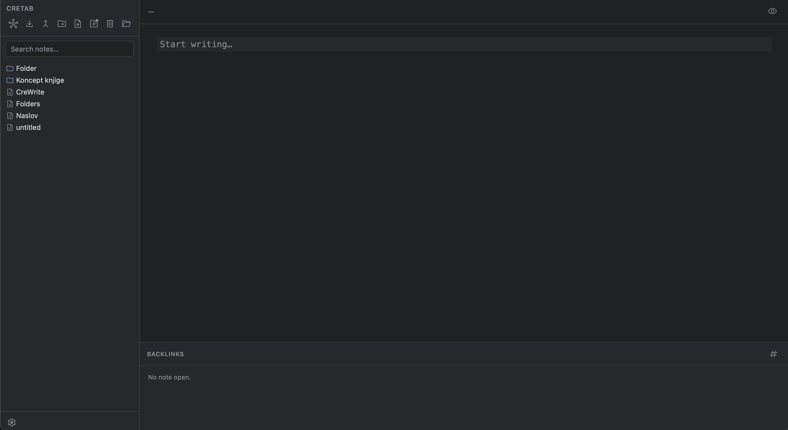
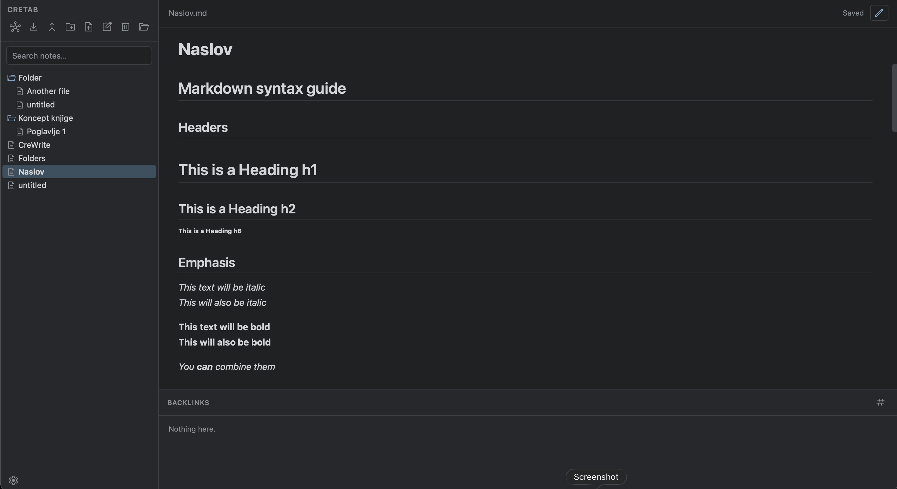
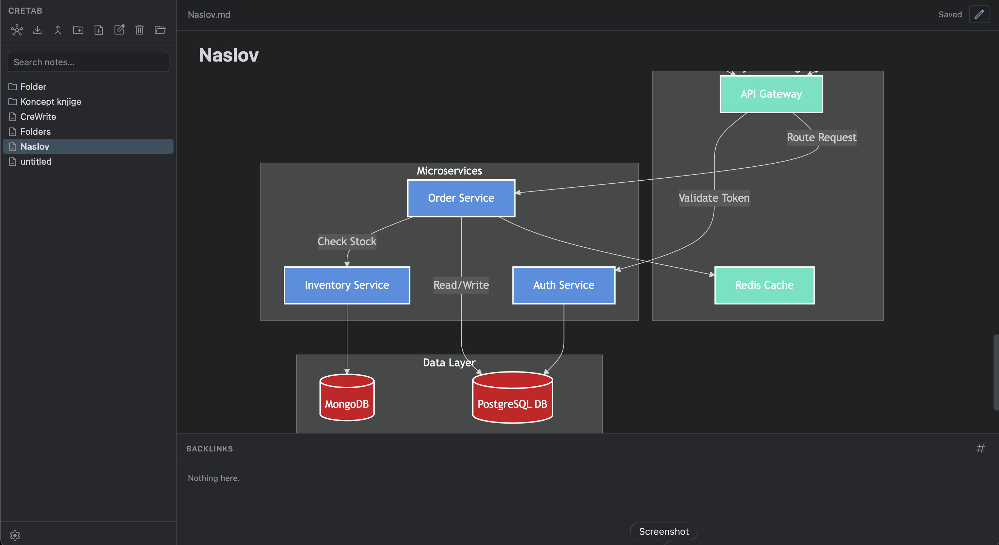
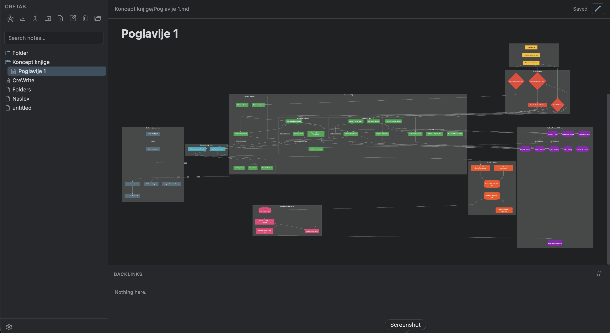
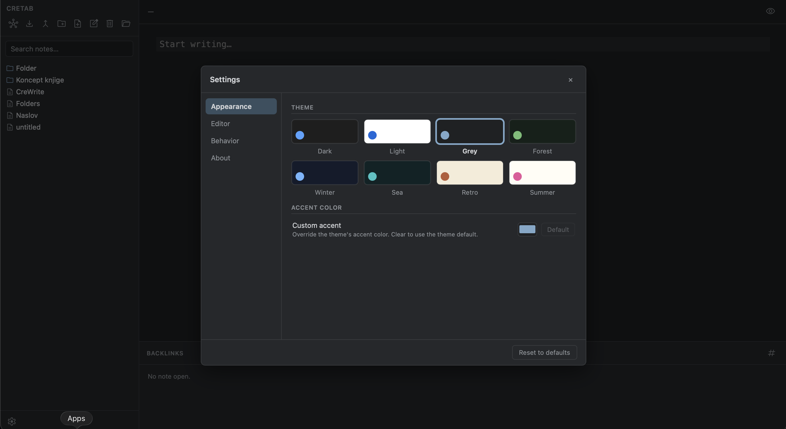

# CreWrite

**A fast, local-first, plain-text Markdown note-taking app.** Your notes are just
`.md` files in a folder you choose — no proprietary database, no lock-in, no cloud
account required. Built with [Tauri 2](https://tauri.app) (Rust) + a lightweight
TypeScript/Vite frontend and a [CodeMirror 6](https://codemirror.net) editor.

> Think of it as a small, hackable, Obsidian-style vault editor that you fully own.
> Open a directory, write Markdown, link notes with `[[wikilinks]]`, and everything
> stays as readable text on your own disk.

[](LICENSE)


---

## Table of contents

- [Why CreWrite](#why-crewrite)
- [Features](#features)
- [Screenshots](#screenshots)
- [Tech stack](#tech-stack)
- [Architecture](#architecture)
- [Project structure](#project-structure)
- [Getting started](#getting-started)
  - [Prerequisites](#prerequisites)
  - [Install & run (development)](#install--run-development)
  - [Build a production app](#build-a-production-app)
- [Usage guide](#usage-guide)
- [Keyboard shortcuts](#keyboard-shortcuts)
- [Where your data lives](#where-your-data-lives)
- [Settings reference](#settings-reference)
- [Contributing](#contributing)
- [License](#license)
- [Acknowledgements](#acknowledgements)
- [A note from the author](#a-note-from-the-author)

---

## Why CreWrite

Most note apps trap your writing in a proprietary format or a remote server. CreWrite
takes the opposite stance:

- **Plain text, forever.** Every note is a standard Markdown (`.md`) file. You can
  open, grep, sync, back up, or edit your vault with any other tool — CreWrite never
  owns your data.
- **Local-first.** No account, no telemetry, no network requirement. Files live in a
  folder you pick (a *vault*). Nothing leaves your machine unless you make it.
- **Fast and small.** A Rust core (via Tauri) handles the filesystem, Markdown
  rendering, indexing, and export. The UI is dependency-light vanilla TypeScript —
  no heavyweight framework.
- **Safe by construction.** Rendered HTML is sanitized server-side, deletes go to the
  OS Trash (recoverable), and unsaved edits are flushed before the window closes.

---

## Features

### Vaults & files
- **Open any folder as a vault** — your notes are the `.md` files inside it.
- **Recent vaults & auto-reopen** — CreWrite remembers your last vault and the most
  recent ones, and reopens the last one on launch.
- **File tree** with distinct folder/file icons and a single, clear selection
  highlight, so it's always obvious what's selected.
- **Create notes and folders** scoped to the selected folder (or the vault root).
- **Drag & drop** to move notes/folders between directories.
- **Rename** in place: an Obsidian-style inline title above the editor, plus a toolbar
  rename action that works for both notes and folders.
- **Delete to the OS Trash** (recoverable from Finder/Explorer) — never a silent
  permanent delete.
- **Filename search** — a quick, client-side filter over the vault.
- **Live external-change sync** — a Rust file watcher keeps the tree, index, and open
  note in sync when files change on disk (without clobbering your unsaved edits).

### Writing & editing
- **CodeMirror 6 editor** with GitHub-Flavored-Markdown syntax highlighting.
- **`[[wikilink]]` and `#tag` autocomplete** sourced from your existing notes.
- **Formatting shortcuts** (`⌘/Ctrl+B`, `⌘/Ctrl+I`) and **find/replace** (`⌘/Ctrl+F`).
- **Auto-pairing** of brackets/quotes, configurable **tab vs. spaces** indentation,
  optional **line numbers**, soft **line wrapping**, and **spellcheck**.
- **Autosave** with a configurable debounce, plus save-on-blur / save-on-quit so you
  never lose the last few keystrokes.

### Reading & preview
- **Editor ⇄ Preview toggle** (full-width reading mode — by design, *not* a split view).
- **GFM rendering** (headings, tables, task lists, code fences, etc.) parsed in Rust
  with [`pulldown-cmark`] and **sanitized** with [`ammonia`] (XSS-safe).
- **Interactive preview** — tick task-list checkboxes directly in reading mode and the
  change is written back to the source `.md`.
- **YAML frontmatter** is parsed and shown as a tidy "properties" panel.
- **Mermaid diagrams** — ` ```mermaid ` fenced blocks render to SVG (lazily loaded).
- **External links** open in your system browser (never inside the app webview).

### Knowledge graph
- **`[[wikilinks]]`** resolve to notes; missing links can create the target note.
- **`#tags`** are clickable and aggregated into a tag cloud with counts.
- **Backlinks panel** shows every note that links to the one you're reading.
- **Graph view** visualizes the relationships between notes.

### Export & compile
- **Built-in export to DOCX and PDF** — fully compiled into the app, **no Pandoc or
  any external tool required**. DOCX is generated with [`docx-rs`] and PDF with
  [`genpdf`] (fonts embedded).
- **Formatting carries over** — headings, bold/italic, lists, blockquotes, code
  blocks, real **tables** (bordered, with a bold header), and **task-list checkboxes**
  (☐ / ☑). **Mermaid diagrams** embed as images in PDF; in Word they export as their
  source text.
- Choose the **scope** (current note / a folder / the whole vault), **combine into one
  document or one file per note**, and optionally **strip frontmatter**.
- **Compile a folder** into a single Markdown file (each note prefixed with an `# H1`,
  frontmatter stripped) — great for assembling a long document from many notes.

### Appearance & settings
- **Tabbed settings panel** (Appearance / Editor / Behavior / About) with inline help
  text and a one-click **Reset to defaults**.
- **8 built-in themes** — Dark, Light, Grey, Forest, Winter, Sea, Retro, Summer —
  picked from visual color **swatches**.
- **Custom accent color** that overrides the theme's accent.
- Tunable **editor font family** (mono/sans/serif), **font size**, **line height**, and
  an optional **readable line width** that centers text in a comfortable column.

---

## Screenshots

**Main interface** — the vault file tree, editor, and backlinks panel.



**Reading mode** — Markdown rendered with headings, emphasis, and more.



**Mermaid diagrams** — ` ```mermaid ` fenced blocks render to SVG inline.





**Settings** — tabbed panel with theme swatches and a custom accent color.



---

## Tech stack

| Layer        | Technology |
|--------------|------------|
| Shell / desktop | [Tauri 2](https://tauri.app) (Rust) |
| Backend logic   | Rust — filesystem, Markdown, indexing, export |
| Frontend        | Vanilla **TypeScript** + [Vite](https://vitejs.dev) |
| Editor          | [CodeMirror 6](https://codemirror.net) |
| Markdown        | [`pulldown-cmark`] (GFM) + [`ammonia`] (sanitizer) |
| Diagrams        | [Mermaid](https://mermaid.js.org) (lazy-loaded) |
| Export          | [`docx-rs`] (DOCX) + [`genpdf`] (PDF) |
| Delete safety   | [`trash`] crate (OS Trash) |
| File watching   | [`notify`] crate |

[`pulldown-cmark`]: https://crates.io/crates/pulldown-cmark
[`ammonia`]: https://crates.io/crates/ammonia
[`docx-rs`]: https://crates.io/crates/docx-rs
[`genpdf`]: https://crates.io/crates/genpdf
[`trash`]: https://crates.io/crates/trash
[`notify`]: https://crates.io/crates/notify

---

## Architecture

CreWrite keeps a clean split between a **typed command bridge** and pure logic:

- The frontend never calls raw Tauri `invoke()` strings directly — every backend
  command is wrapped in `src/api.ts`, so the rest of the UI stays decoupled.
- Rust commands (`src-tauri/src/commands.rs`) are intentionally thin: they validate
  the session, delegate to pure modules (`vault`, `markdown`, `index`, `export`,
  `compile`, `config`), and shape the response. Errors flow back as a single typed
  `AppError`.
- **Markdown is rendered and sanitized in Rust** before it ever reaches the DOM, so
  the preview can't execute injected scripts.
- **All paths are validated** against the vault root (no traversal outside the vault).
- **Settings and recent vaults** persist as a small `config.json` in the OS app-config
  directory (no extra database).

---

## Project structure

```
CreWrite/
├── index.html               # Vite entry
├── package.json             # Frontend deps & scripts
├── vite.config.ts
├── src/                     # Frontend (TypeScript)
│   ├── main.ts              # App shell, wiring, state orchestration
│   ├── api.ts               # Typed wrappers around every Tauri command
│   ├── store.ts             # Minimal app state
│   ├── types.ts             # TS mirrors of the Rust types
│   ├── styles.css           # Themes + layout
│   └── ui/
│       ├── editor.ts        # CodeMirror 6 editor
│       ├── preview.ts       # Sanitized HTML preview + Mermaid + tasks
│       ├── tree.ts          # File tree (icons, selection, drag & drop)
│       ├── graph.ts         # Graph view
│       ├── settings.ts      # Tabbed settings panel
│       ├── export.ts        # Export popup
│       ├── modal.ts         # In-app prompt/confirm dialogs
│       └── icons.ts         # Material Symbols (inlined SVG)
└── src-tauri/               # Backend (Rust)
    ├── Cargo.toml
    ├── tauri.conf.json
    └── src/
        ├── lib.rs           # Tauri builder + command registration
        ├── commands.rs      # The invoke() command layer
        ├── vault/           # Path validation + filesystem ops
        ├── markdown.rs      # GFM render + sanitize + task toggle
        ├── index.rs         # Links / tags / backlinks / graph
        ├── export.rs        # Markdown → DOCX / PDF
        ├── compile.rs       # Concatenate a folder into one file
        ├── config.rs        # Settings + recent vaults (config.json)
        └── watcher.rs       # Filesystem change events
```

---

## Getting started

### Prerequisites

CreWrite is a Tauri 2 app, so you need both a JavaScript and a Rust toolchain:

1. **[Rust](https://www.rust-lang.org/tools/install)** (stable) — includes `cargo`.
2. **[Node.js](https://nodejs.org)** 18+ and `npm`.
3. **Platform dependencies for Tauri** — follow the official prerequisites guide for
   your OS: <https://tauri.app/start/prerequisites/>.
   - **macOS:** Xcode Command Line Tools (`xcode-select --install`).
   - **Windows:** Microsoft C++ Build Tools + the WebView2 runtime.
   - **Linux:** `webkit2gtk`, `libappindicator`, and related packages (see the guide).

### Install & run (development)

```bash
# 1. Install frontend dependencies
npm install

# 2. Launch the app in development (hot-reloading webview + Rust)
npm run tauri dev
```

`npm run tauri dev` starts the Vite dev server (port 1420) and the Tauri shell
together. The first run compiles the Rust crate, so it takes a little while; later
runs are fast.

> Want just the web frontend in a browser (no native shell)? `npm run dev` serves the
> UI on <http://localhost:1420>, but native features (file dialogs, the filesystem,
> export, Trash) only work inside the Tauri shell.

### Build a production app

```bash
# Type-check + bundle the frontend, then build the native app + installers
npm run tauri build
```

The packaged binaries/installers are written under `src-tauri/target/release/`
(and `.../bundle/` for installers), matching your current platform.

### Useful checks

```bash
npm run build              # tsc type-check + Vite production bundle
npx tsc --noEmit           # type-check only
cargo test --lib           # Rust unit tests  (run inside src-tauri/)
cargo check                # fast Rust compile check (run inside src-tauri/)
```

---

## Usage guide

1. **Open a vault.** Click the *Open vault* button and pick any folder. Its `.md`
   files appear in the tree. On the next launch CreWrite reopens it automatically.
2. **Create notes.** Select a folder (or the root), then use *New note* / *New folder*.
   New notes can default to the current folder or the vault root (a setting).
3. **Write Markdown.** The editor highlights GFM. Type `[[` to autocomplete a link to
   another note, or `#` to autocomplete a tag.
4. **Switch to reading mode** with the preview toggle to see rendered output, tick task
   checkboxes, view frontmatter properties, and render Mermaid diagrams.
5. **Navigate your knowledge.** Click wikilinks and tags, read the backlinks panel, or
   open the **graph view** to see how notes connect.
6. **Export** via the export popup — pick DOCX or PDF, a scope, and whether to combine
   notes or strip frontmatter. Or **compile** a folder into a single Markdown file.
7. **Tune it** in Settings (gear, lower-left): theme, accent, editor typography and
   behavior.

---

## Keyboard shortcuts

| Action | macOS | Windows/Linux |
|--------|-------|---------------|
| Save now | `⌘S` | `Ctrl+S` |
| Bold | `⌘B` | `Ctrl+B` |
| Italic | `⌘I` | `Ctrl+I` |
| Find / replace | `⌘F` | `Ctrl+F` |
| Indent / outdent | `Tab` / `Shift+Tab` | `Tab` / `Shift+Tab` |
| Accept autocomplete | `Enter` / `Tab` | `Enter` / `Tab` |
| Open first search result | `Enter` (in search box) | `Enter` (in search box) |
| Clear search | `Esc` (in search box) | `Esc` (in search box) |
| Close a dialog / settings | `Esc` | `Esc` |
| Commit inline rename | `Enter` | `Enter` |
| Cancel inline rename | `Esc` | `Esc` |

---

## Where your data lives

- **Your notes** are plain `.md` files inside the vault folder you chose. That's the
  whole database — back it up, sync it, or version-control it like any other folder.
- **App settings & recent vaults** live in a small `config.json` in the OS app-config
  directory:
  - **macOS:** `~/Library/Application Support/com.crewrite.app/config.json`
  - **Linux:** `~/.config/com.crewrite.app/config.json`
  - **Windows:** `%APPDATA%\com.crewrite.app\config.json`

  (The exact path is shown in **Settings → About**.)

---

## Settings reference

| Tab | Setting | Description |
|-----|---------|-------------|
| Appearance | Theme | One of 8 built-in palettes (visual swatches). |
| Appearance | Custom accent | Override the theme's accent color; clear to revert. |
| Editor | Font size / family / line height | Editor typography (mono / sans / serif). |
| Editor | Readable line width | Cap & center the editor/preview in a comfortable column. |
| Editor | Wrap long lines | Soft-wrap lines past the editor width. |
| Editor | Show line numbers | Toggle the line-number gutter. |
| Editor | Auto-pair brackets | Auto-close brackets and quotes. |
| Editor | Spellcheck | Underline misspellings via the system dictionary. |
| Editor | Indent with tabs / Tab size | Tab vs. spaces, and indent width. |
| Behavior | Open notes in | Default to edit or preview mode. |
| Behavior | New notes go to | Current folder or vault root. |
| Behavior | Autosave delay | Debounce before edits are written. |
| Behavior | Confirm before delete | Ask before moving to the Trash. |
| About | — | App version, open vault, and config file location. |

---

## Contributing

Contributions are welcome! A good workflow:

1. Fork the repo and create a feature branch.
2. Make your change. Keep the typed `api.ts` ↔ thin-`commands.rs` split, and keep the
   TS types in `src/types.ts` in sync with the Rust types.
3. Run the checks before opening a PR:
   ```bash
   npx tsc --noEmit
   npm run build
   (cd src-tauri && cargo test --lib && cargo check)
   ```
4. Open a pull request describing the change.

> Note on dependencies: avoid `cargo generate-lockfile` to add a Rust crate (it can
> re-resolve the whole graph). Add the dependency to `Cargo.toml` and run `cargo build`
> for a minimal lockfile update.

---

## License

CreWrite is released under the **CreWrite Source-Available License** — the full text
is in [`LICENSE`](LICENSE). Copyright © 2026 Edic189 / Luka Prlić. All rights reserved.

In short: the source is public so you can **view, study, clone, build, and test it for
personal, non-commercial use**, and you're welcome to open issues or pull requests.
You may **not** sell it, repackage/rebrand and redistribute it, or host it as a
commercial service. See the [`LICENSE`](LICENSE) for the binding terms.

---

## Acknowledgements

Built on the shoulders of excellent open-source projects: [Tauri](https://tauri.app),
[CodeMirror](https://codemirror.net), [pulldown-cmark][`pulldown-cmark`],
[ammonia][`ammonia`], [Mermaid](https://mermaid.js.org), [docx-rs][`docx-rs`],
[genpdf][`genpdf`], and the broader Rust and TypeScript communities.

---

## A note from the author

I hope someone benefits from this project. It was partly *vibe-coded*, and I learned a
lot building it. I won't hide that AI was used — even though I'm not really a fan of
generative AI, these days you can't fully escape it. All in all, I hope you enjoy this
program at least half as much as I enjoyed building it.
